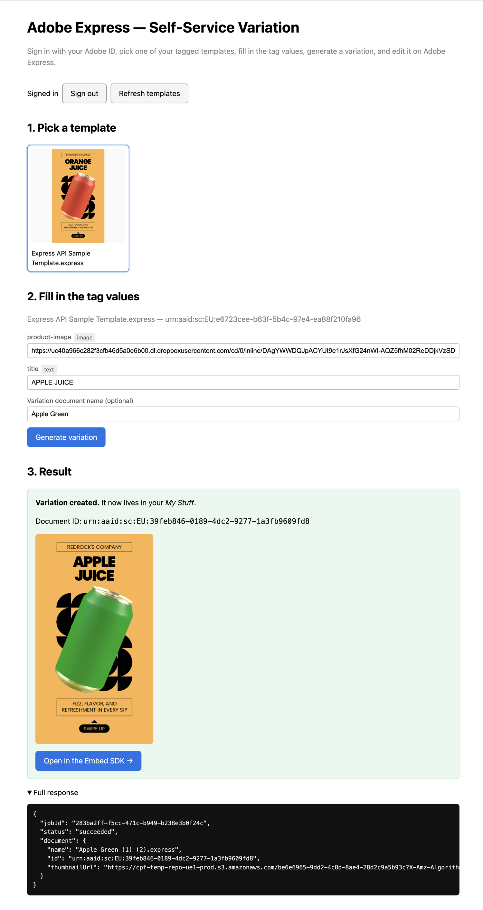
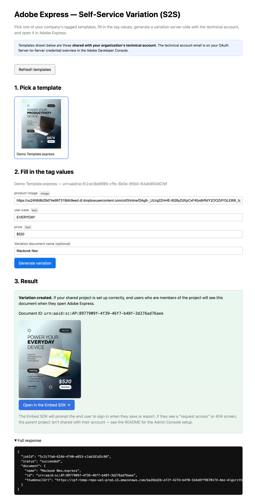

# Express API Samples

This repository contains samples for the **Adobe Express API**. The full documentation is available at <https://developer.adobe.com/firefly-services/docs/express-api/>.

Each sample is a minimal, runnable end-to-end implementation of the **self-service variation workflow** (list tagged templates → inspect tags → generate a variation → poll the job → hand the result off to the end user), packaged as a small Vite + Express app you can run locally against a real Developer Console project.

## Samples

<table>
  <tr>
    <td width="50%" align="center">
       
      <a href="./oauth-web-app"><code>oauth-web-app/</code></a>
    </td>
    <td width="50%" align="center">
       
      <a href="./oauth-server-to-server"><code>oauth-server-to-server/</code></a>
    </td>
  </tr>
</table>

| Sample                                                | Auth flow                                                                                                                                                              | Companion guide                                                                                                                                             |
| ----------------------------------------------------- | ---------------------------------------------------------------------------------------------------------------------------------------------------------------------- | ----------------------------------------------------------------------------------------------------------------------------------------------------------- |
| [`oauth-web-app/`](./oauth-web-app)                   | OAuth Web App (3-legged, `authorization_code`) — each end user signs in with their own Adobe ID and works on their own tagged templates.                               | [Generate and Edit a Variant (OAuth Web App)](https://developer.adobe.com/firefly-services/docs/express-api/guides/how-to/e2e-generate-edit-variant-oauth)  |
| [`oauth-server-to-server/`](./oauth-server-to-server) | OAuth Server-to-Server (`client_credentials`) — the organization owns a curated catalog of templates and the backend drives variation creation on behalf of end users. | [Generate and Edit a Variant (Server-to-Server)](https://developer.adobe.com/firefly-services/docs/express-api/guides/how-to/e2e-generate-edit-variant-s2s) |

Pick the sample that matches your scenario: **OAuth Web App** when each user works on _their own_ templates and the variation should land in _their own_ Adobe Express storage; **Server-to-Server** when the _company_ curates the templates and you want a _single backend integration_ to drive variation creation and sharing.

## Prerequisites

- Node.js 18+
- An Adobe Developer Console project with the **Adobe Express API** added and the appropriate credential type for the sample you want to run (OAuth Web App or OAuth Server-to-Server).
- At least one Express document tagged with the **Tag Elements add-on**.

See each sample's `README.md` for the full, auth-flow-specific setup steps.
